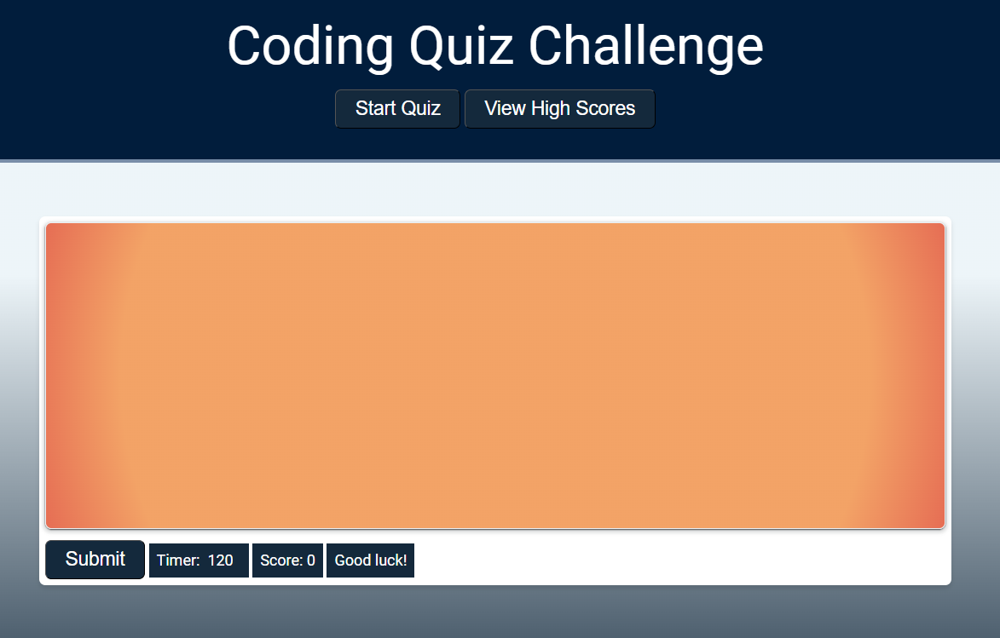

# coding-assessment

## Description

As a technology professional with over a decade of experience, I understand the importance of online security, and creating strong, unique passwords is a crucial aspect of that.

I wanted to create this password generator to make it easier for myself and others to generate secure passwords, and by offering customization options the generator allows users to create passwords that suit their needs and preferences, while maintaining a high level of security.

Working on this project has allowed me to strengthen my programming skills in HTML, CSS, and JavaScript, and develop a better understanding of web development and user experience design.

## Installation

No installation required, but if you want to run this locally:

### Requirements

- [Visual Studio Code](https://code.visualstudio.com/download)

- [Live Server Extension](https://marketplace.visualstudio.com/items?itemName=ritwickdey.LiveServer)

## Usage

1. You will require an IDE such as Visual Studio Code. 

2. After installing Visual Studio Code, install the Live Server extension.

3. Download the project code and export it to your local machine.

4. Open the folder where index.html resides in Visual Studio Code.

5. Right-click index.html and choose "Open with Live Server".

6. Click the Start Quiz button to start the quiz.

## Preview

[Link to site](https://justjenb.github.io/coding-assessment/)

## Credits

Started with code from our mini-project this week and with some starter code from other exercises

Save high scores in local storage [Michael Karen](https://michael-karen.medium.com/how-to-save-high-scores-in-local-storage-7860baca9d68)

Line breaks in the DOM [colinaz](https://board.phpbuilder.com/d/10361933-resolved-adding-linebreak-using-javascript-dom/9)

Radio button fun [Mark Biek and Pragnesh Rupapara](https://stackoverflow.com/a/1423783)

Set multiple attributes on an element [Ariel](https://stackoverflow.com/a/12274782)

Referenced when building the high score table [Minna N.](https://dev.to/minna_xd/adding-a-high-score-table-to-javascript30-whack-a-mole-4adk)

JavaScript interview questions courtesy of [InterviewBit](https://www.interviewbit.com/javascript-interview-questions/)

## License

The last section of a high-quality README file is the license. This lets other developers know what they can and cannot do with your project. If you need help choosing a license, refer to [https://choosealicense.com/](https://choosealicense.com/).

